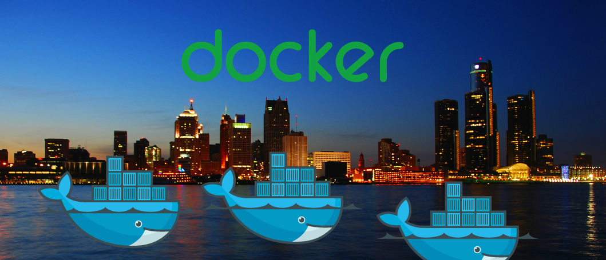
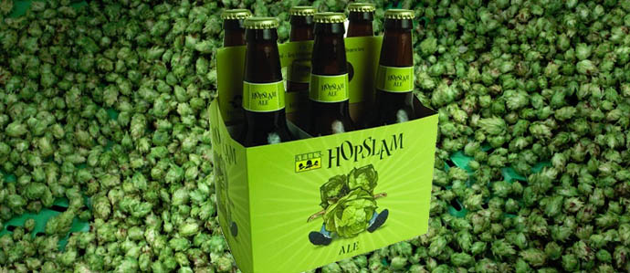

title: Phil's Docker Presentation
theme: pgporada/cleaver-dark
progress: true
encoding: utf-8
output: presentation.html
controls: true
author:
    name: Phil Porada
    url: http://greenlancer.com
    email: philporada@gmail.com && pporada@greenlancer.com
    twitter: pgporada
    github: https://github.com/pgporada
    weibo: Made with <3 by https://jennyingles.com

--

<h1>Docker: There and Back Again</h1>
</img>

--

### Who am I?
* **Name**: Phil Porada
</img>

--

### Who am I?
* **Name**: Phil Porada
* **Occupation**: Linux Engineer
</img>

--

### Who am I?
* **Name**: Phil Porada
* **Occupation**: Linux Engineer
* **Workplace**: GreenLancer located in downtown Detroit, MI
</img>

--

### Who am I?
* **Name**: Phil Porada
* **Occupation**: Linux Engineer
* **Workplace**: GreenLancer located in downtown Detroit, MI
* **Beer**: Yes, please! 
</img>

--

### Agenda
* <font color="#ff000">Docker Intro, Requirements, Terminology, & Expectation Management</font>
* Docker Commands, Troubleshooting
* Troubleshooting
* ===== DEMO =====
* Writing your own Dockerfiles
* Developer Workflow
* ===== DEMO =====
* Docker Security
* Docker Networking
* Cleanup
* ===== DEMO =====
* Day to day Docker usage @ GreenLancer
* Questions and Answers

--

### Container History
* chroot 1982
* BSD Jails 200
* Solaris Zones 2004
* LXC since 2008
* Docker 2013
* More to come, but there is an Open Container Standard!

--

### Container History
* chroot 1982
* BSD Jails 200
* Solaris Zones 2004
* LXC since 2008
* Docker 2013
* More to come, but there is an Open Container Standard!

</img>

--

### What is Docker?
* Started in 2013 @ dotCloud

--

### What is Docker?
* Started in 2013 @ dotCloud
* Written in Go

</img>

--

### What is Docker?
* Started in 2013 @ dotCloud
* Written in Go
* Finally allows code to be written once and ran on any\* system
<br>
<br>
<br>
<br>
<br>
\* If that system runs a 64bit Linux/FreeBSD/Solaris kernel
<br>
\*\* or an NT kernel.. soon

--

### What is Docker?
* Started in 2013 @ dotCloud
* Written in Go
* Finally allows code to be written once and ran on any\* system
* Huge traction on Github - 30,368 stars as of 04/12/2016

--

### What is Docker?
* Started in 2013 @ dotCloud
* Written in Go
* Finally allows code to be written once and ran on any\* system
* Huge traction on Github - 30,368 stars as of 04/12/2016
* Every big tech company and their brothers/sisters are creating PaaS' utilizing container technology
</img>

--

### What Docker is NOT
* Containers are not VMs nor will ever be

--

### What Docker is NOT
* Containers are not VMs nor will ever be
* The end of operations

--

### What Docker is NOT
* Containers are not VMs nor will ever be
* The end of operations
* A walk in the park
</img>

--

### Why even use it?

* Deployments become easier

--

### Why even use it?

* Deployments become easier
* Build artifacts work on every system

--

### Why even use it?

* Deployments become easier
* Build artifacts work on every system
* Rollbacks are near instant (to humans)

--

### Why even use it?

* Deployments become easier
* Build artifacts work on every system
* Rollbacks are near instant (to humans)
* Containers will only become more prevalent as time goes on
* * Microsoft has even embraced them

--

### Why even use it?

* Deployments become easier
* Build artifacts work on every system
* Rollbacks are near instant (to humans)
* Containers will only become more prevalent as time goes on
* * Microsoft has even embraced them
* You can put legacy applications/software in a locked down container and still upgrade the host that the container runs on. Applications should not halt infrastructure upgrades.

--

### Why even use it?

* Deployments become easier
* Build artifacts work on every system
* Rollbacks are near instant (to humans)
* Containers will only become more prevalent as time goes on
* * Microsoft has even embraced them
* You can put legacy applications/software in a locked down container and still upgrade the host that the container runs on. Applications should not halt infrastructure upgrades.

--

### Docker Requirements

| <font color="#00cc00">Runtime Dependency</font> | <font color="#00cc00">Version</font> |
| --- | --- |
| iptables    | >= 1.4 |
| git         | >= 1.7 |
| procps (ps) | any |
| xz compression engine | >= 4.9 |
<hr style="height:2pt; visibility:hidden;" />

| <font color="#00cc00">Kernel Version</font> | <font color="#00cc00">Does it work?</font> | <font color="#00cc00">Notes</font> |
| --- | --- | --- |
| >= 3.10 | Yes | Installed on RHEL/CentOS7 out of the box. |
| >= 3.16 | Yes | Needed for multi-host networking on Swarm. Can be acquired via ELRepo |
| < 3.10  | No | Do not use an older version of Docker. This technology evolves quickly. |

* Docker Dependencies: https://docs.docker.com/engine/installation/binaries/
* CentOS 6 ELRepo kernel: https://docs.docker.com/engine/installation/binaries/

--

### Docker Terminology
<hr style="height:2pt; visibility:hidden;" />

|  <font color="#00cc00">Docker Term</font> | <font color="#00cc00">Definition</font>  |
| :-- | -- |
| Layer | Read-only files that have run to provision the system. |
| Image | Basis of all containers. |
| Container | A running image. |
| Registry | Centralized place to store containers. |
| Manifest | Contains the name, tag, history, etc of an image. |
| Container ID/CID |A SHA256 checksum of the entire image manifest. |

</img>

--

### Docker commands
#### docker info
* Display system-wide information
```
$ docker info
Containers: 77
 Running: 0
 Paused: 0
 Stopped: 77
Images: 509
Server Version: 1.10.3
Storage Driver: aufs
 Root Dir: /var/lib/docker/aufs
 Backing Filesystem: extfs
 Dirs: 851
 Dirperm1 Supported: true
Execution Driver: native-0.2
Logging Driver: json-file
Plugins:
 Volume: local
 Network: null host bridge
Kernel Version: 4.2.0-34-generic
Operating System: Ubuntu 15.10
OSType: linux
Architecture: x86_64
CPUs: 4
Total Memory: 7.707 GiB
```
--

### Docker commands
#### docker ps
* Process oriented API that shows running docker containers
```
$ docker ps
CONTAINER ID        IMAGE               COMMAND             CREATED             STATUS              PORTS               NAMES
a870e1ec8f92           httpd               "httpd-foreground"   2 seconds ago       Up 1 seconds        80/tcp              jovial_jones
```

--

### Docker commands
#### docker ps -a
* Show docker containers in any state
```
$ docker ps -a
CONTAINER ID        IMAGE               COMMAND             CREATED             STATUS              PORTS               NAMES
a870e1ec8f92           httpd                 "httpd-foreground"  2 seconds ago       Up 1 seconds        80/tcp              jovial_jones
0601aae9ccaa           467fe3d6319c       "/bin/sh -c 'mkdir -p"    1 hour ago         Exited (1) 1 hour ago                 cocky_perlman
44e21f1e0eae           centos:centos7     "-it bash"                1 hour ago         Created                               naughty_stallman
```

--

### Docker commands
####docker run $CID
* Run a container in the foreground

```
$ docker run httpd
AH00558: httpd: Could not reliably determine the server's fully qualified domain name, using 10.250.1.3. Set the 'ServerName' directive globally to suppress this message
AH00558: httpd: Could not reliably determine the server's fully qualified domain name, using 10.250.1.3. Set the 'ServerName' directive globally to suppress this message
[Mon Apr 11 23:59:08.108723 2016] [mpm_event:notice] [pid 1:tid 140473353303936] AH00489: Apache/2.4.18 (Unix) configured -- resuming normal operations
[Mon Apr 11 23:59:08.108784 2016] [core:notice] [pid 1:tid 140473353303936] AH00094: Command line: 'httpd -D FOREGROUND'
```

--

### Docker commands
#### docker run -d $CID
* Run a container in the background

```
$ docker run -d httpd
e6902788cd79fd5782f2fdb464b9d061f12395aad1aa7a7487822764de3f811c

$ docker ps
CONTAINER ID        IMAGE               COMMAND              CREATED             STATUS              PORTS               NAMES
e6902788cd79        httpd               "httpd-foreground"   5 hours ago         Up 5 hours          80/tcp              awesome_payne
```

--

### Troubleshooting
#### docker logs $CID
* Get logs from a container
```
$ docker logs e69
```

--

### Agenda
* Requirements, Terminology, Intro to Docker, & Expectation Management
* Docker Commands
* Troubleshooting
* <font color="#ff0000">===== DEMO-1 =====</font>
* Writing your own Dockerfiles
* Developer Workflow
* ===== DEMO-2 =====
* Docker Security
* Docker Networking
* Cleanup
* ===== DEMO-3 =====
* Day to day Docker usage @ GreenLancer
* Questions and Answers

-- center

<br>
<br>
# DEMO-1

--

### Writing your own Dockerfiles
#### Dockerfile Commands
```
    FROM
    MAINTAINER
    ADD
    ENV
    EXPOSE
    RUN
    USER
    VOLUME
    WORKDIR
    CMD
    ENTRYPOINT
```

--

### Writing your own Dockerfiles
#### Example Dockerfile
```
FROM centos:centos7
MAINTAINER The CentOS Project <cloud-ops@centos.org>

RUN yum -y install \
    openssl-devel \
    openssl \
    readline \
    readline-devel \
    gcc \
    gcc-c++ \
    rubygems \
    rubygems-devel \
    ruby \
    ruby-devel; \
yum clean all

# install earthquake
RUN gem install earthquake

RUN useradd -d /home/twitter twitter
USER twitter
ENV HOME /home/twitter
WORKDIR /home/twitter

CMD ["earthquake"]
```

--

### Developer Workflow
A developer will need to run multiple applications together to simulate the actual environment.

Typically this is done in VM(s), but there are some downsides to this
* Multiple VMs can become ram/cpu/disk intensive just to run the OS
* When a change is made to the VM, rollback is a destruction and re-provisioning of the VM
* If using a single VM, it's not easy to run multiple database or application versions concurrently

--

### Developer Workflow
Benefits of a containerized workflow
* Containers are far lighter than a VM
* Resources can be limited via namespaces/cgroups

A developer start multiple versions of the same application on the same piece of hardware in moments

--

### Agenda
* Requirements, Terminology, Intro to Docker, & Expectation Management
* Docker Commands
* Troubleshooting
* ===== DEMO-1 =====
* Writing your own Dockerfiles
* Developer Workflow
* <font color='#ff0000'>===== DEMO-2 =====</font>
* Docker Security
* Docker Networking
* Cleanup
* ===== DEMO-3 =====
* Day to day Docker usage @ GreenLancer
* How to get help
* Questions and Answers

-- center

<br>
<br>
# DEMO-2

--

### Docker Security
#### Terminology
<hr style="height:2pt; visibility:hidden;" />

|  <font color="#00cc00">Docker Term</font> | <font color="#00cc00">Explanation</font> |
| :----------- | ----------- |
| Namespaces | Provides a view of the system that make the container appear to have all of the hosts resources. Examples are PIDs, Mounts, IPC, and Network. |
| User Namespaces | Distinguish container privileged vs host privileged root user. |
| Cgroups | Constrain what resources a container is allowed to use. |
| Capabilities | What the container 'root' can do such as run ptrace or chown. |
| AppArmor & SELinux | Allow containers to actually contain. |
| Seccomp | Acts as a syscall firewall. When a userland process wants to communicate with the kernel, communication travels through the syscall interface. This includes opening files, loading kernel modules, etc|

--

### Docker Security
#### Example of Namespacing
Process 1 inside of a container
```
$ docker ps
CONTAINER ID        IMAGE               COMMAND                  CREATED             STATUS              PORTS               NAMES
b60d110ad078        nginx               "nginx -g 'daemon off"   4 minutes ago       Up 3 minutes        80/tcp, 443/tcp     evil_perlman
```
```
$ docker exec -i b60 ps
  PID TTY          TIME CMD
    1 ?        00:00:00 nginx
   10 ?        00:00:00 ps
```
```
$ docker exec -i b60 hostname
b60d110ad078
```

vs root on my host
```
root@laptappy:~# ps aux
USER       PID %CPU %MEM    VSZ   RSS TTY      STAT START   TIME COMMAND
root         1  0.0  0.0 185172  4496 ?        Ss   Apr07   0:06 /sbin/init splash
root         2  0.0  0.0      0     0 ?        S    Apr07   0:00 [kthreadd]
root         3  0.0  0.0      0     0 ?        S    Apr07   0:12 [ksoftirqd/0]
root         5  0.0  0.0      0     0 ?        S<   Apr07   0:00 [kworker/0:0H]
```

--

### Docker Security
#### SELinux, the Docker socket, other bad ideas
Instant root on a host that exposes the Docker socket to it's containers when SELinux is not enabled
```
docker run -ti --privileged -v /:/host fedora chroot /host
```

</img>
<center>Dan Walsh - creator of SELinux<center>

* http://danwalsh.livejournal.com/74095.html

--

### Docker Security
#### SELinux, the Docker socket, other bad ideas
Instant root on a host that exposes the Docker socket to it's containers when SELinux is not enabled
```
docker run -ti --privileged -v /:/host fedora chroot /host
```

</img>
<center>Dan Walsh - creator of SELinux<center>

* http://danwalsh.livejournal.com/74095.html

--

### Docker Security
#### SELinux, the Docker socket, other bad ideas
Running Docker on a host without enabling TLS on the daemon.
* Anyone who can get network access to the docker port can start/stop containers

</img>
<center>Hooray containers are working! ... oh<center>

--

### Docker Security
#### SELinux, the Docker socket, other bad ideas
Allowing docker access without sudo, especially on a non-development machine.
```
usermod -aG docker $USER
```

</img>

--

### Docker Security
It takes a team to not have this happen to you.
* Operations must work with Development
* Development must work with Operations
* Security admins are strict for a reason
* Rushing is a bad idea and will end poorly
* Continuously improve together
</img>

--

### Docker Networking
#### Host network interface/iptables
Docker creates a bridge interface named **docker0** when the daemon starts.
```
$ ip addr | grep docker0
11: docker0: <BROADCAST,MULTICAST,UP,LOWER_UP> mtu 1500 qdisc noqueue state UP group default
    inet 10.250.1.1/24 scope global docker0
```

```
$ sudo iptables -S
-P INPUT ACCEPT
-P FORWARD ACCEPT
-P OUTPUT ACCEPT
-N DOCKER
-N DOCKER-ISOLATION
-A INPUT -i lo -j ACCEPT
-A INPUT -m state --state RELATED,ESTABLISHED -j ACCEPT
-A INPUT -p tcp -m tcp --dport 80 -j ACCEPT
-A INPUT -p tcp -m tcp --dport 443 -j ACCEPT
-A INPUT -p icmp -m icmp --icmp-type 8 -j ACCEPT
-A FORWARD -j DOCKER-ISOLATION
-A FORWARD -o docker0 -j DOCKER
-A FORWARD -o docker0 -m conntrack --ctstate RELATED,ESTABLISHED -j ACCEPT
-A FORWARD -i docker0 ! -o docker0 -j ACCEPT
-A FORWARD -i docker0 -o docker0 -j ACCEPT
-A OUTPUT -j ACCEPT
-A DOCKER-ISOLATION -j RETURN
```

* Firewalld DOES NOT play nicely with Docker yet per https://github.com/docker/docker/issues/16137

--

### Docker Networking
#### Container to container communication
* Docker containers can communicate with each other over the **docker0** bridge network.
* Containers can use names to reference each other
* Will be shown during the demo

--

### Docker Networking
#### Swarm
Assume the following infrastructure
* HostA, HostB, and HostC can all communicate with each other
* Each host runs a docker daemon
* Communication for containers should be possible between hosts, right?
</img>

--

### Docker Networking
#### Swarm
With Docker Swarm, this is now possible with thanks due to overlay networking.
* Provides standardized Docker API to manage individual Docker hosts.
* Resources of the Docker Swarm hosts are pooled allowing containers to be packed wherever they can fit barring constraints
* Similar projects are Apache Mesos and Kubernetes
</img>

--

### Cleanup

Docker images can eat up a lot of space, especially if you're constantly rebuilding and tagging. This size though is
```
$ docker images
REPOSITORY                              TAG                  IMAGE ID            CREATED             SIZE
greenlancer/jenkins-slave               latest               3bd6965573c9        5 hours ago         854.2 MB
greenlancer/jenkins-slave               0.4.0                c41c6fd546e9        30 hours ago        716.1 MB
greenlancer/jenkins-slave               0.3.0                122f48e241e5        30 hours ago        535.5 MB
greenlancer/jenkins-slave               0.2.0                7d930fd16086        30 hours ago        401.6 MB
greenlancer/jenkins-slave               0.1.0                e67c2d82f3d5        31 hours ago        401.6 MB
```

The total size of that on disk is

--

### Agenda
* Requirements, Terminology, Intro to Docker, & Expectation Management
* Docker Commands
* Troubleshooting
* ===== DEMO-1 =====
* Writing your own Dockerfiles
* Developer Workflow
* ===== DEMO-2 =====
* Docker Security
* Docker Networking
* Cleanup
* <font color='#ff0000'>===== DEMO-3 =====</font>
* Day to day Docker usage @ GreenLancer
* How to get help
* Questions and Answers

-- center

<br>
<br>
# DEMO-3

--

### How do we actually use this in our day to day jobs?
#### Working on micro-services

* Run a docker daemon on a prod-like vagrant VM
* Develop code on the vagrant or locally
* Rebuild dockerfiles
* Test the resulting container with the rest of the local cluster
</img>

--

### How do we actually use this in our day to day jobs?
#### Migrating from development to qa/staging/prod
</img>

--

### The rest of the Docker universe
#### Your Homework
* Service Discovery
* Service Registration
* Data Volumes
* Logging
* End to end testing
* Stateful applications (try not to)

--

### How to get help
#### AKA: Expect to spend a lot of time in these places
* Freenode IRC: #docker
* https://github.com/docker/docker/issues
* Google.

--

### Agenda
* Requirements, Terminology, Intro to Docker, & Expectation Management
* Docker Commands
* Troubleshooting
* ===== DEMO-1 =====
* Writing your own Dockerfiles
* Developer Workflow
* ===== DEMO-2 =====
* Docker Security
* Docker Networking
* Cleanup
* ===== DEMO-3 =====
* Day to day Docker usage @ GreenLancer
* How to get help
* <font color="#ff000">Questions and Answers</font>

--

### Q/A
</img>
